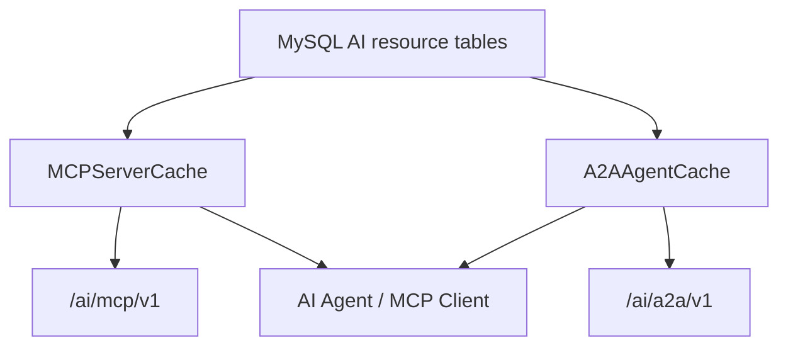
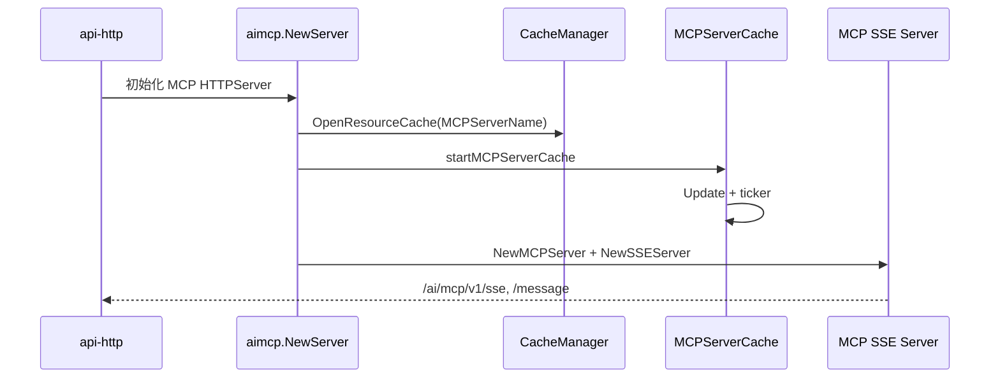
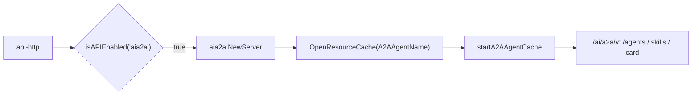

Lattice Hub 的 AI Native 能力不是独立于服务治理之外的演示入口。`pole-control-plane` 已经把 MCP Server 与 A2A Agent 注册为控制面资源：它们有存储接口、缓存接口、HTTP API 入口，并复用 `CacheManager` 的增量刷新机制。

核心实现入口：

- `apis/cache/ai.go`：定义 `MCPServerCache` 与 `A2AAgentCache`。
- `pkg/cache/default.go`：注册 `MCPServerName` 与 `A2AAgentName`。
- `pkg/cache/ai/mcp_server.go`、`pkg/cache/ai/a2a_agent.go`：增量缓存实现。
- `plugin/apiserver/httpserver/aimcp/server.go`：MCP SSE Server 与 MCP 管理 API。
- `plugin/apiserver/httpserver/aia2a/server.go`：A2A Agent 管理与 Agent Card API。
- `plugin/store/mysql/mcp_server.go`：MCP Server 持久化与 revision。

## 资源模型

`MCPServerCache` 暴露以下查询能力：

- 按 ID 查询 MCP Server。
- 按 namespace/name 查询 MCP Server。
- 按 namespace 列出 MCP Server。
- 按 serverID 查询工具列表。
- 按 `MCPServerQuery` 分页查询，支持 name 前缀匹配，namespace/business/department/protocol 精确匹配，按 `MTime DESC` 排序。

`A2AAgentCache` 暴露类似能力：

- 按 ID 查询 Agent。
- 按 namespace/name 查询 Agent。
- 按 namespace 列出 Agent。
- 查询 Agent skills。
- 按 query 分页查询。

这两个 cache 和服务、实例、治理规则一样，都进入 `CacheManager`。

## MCP Server 启动链路

HTTP Server 在 `Run` 时会创建 `aimcp.HTTPServer`。`aimcp.NewServer` 会：

1. 获取配置中心、服务发现、缓存管理器和存储对象。
2. 调用 `cacheMgr.OpenResourceCache(MCPServerName)` 打开 MCP Server 缓存。
3. 调用 `startMCPServerCache` 立即更新一次缓存，并按 `CacheManager.GetUpdateCacheInterval()` 周期刷新。
4. 创建 `server.NewMCPServer("pole.io", version.Get(), ...)`。
5. 创建 SSE Server，base path 为 `/ai/mcp/v1`，SSE endpoint 为 `/sse`，message endpoint 为 `/message`。
6. 在 SSE context 中重写 `Authorization` header，去掉 `Bearer ` 前缀后写入请求上下文。

## A2A Agent 启动链路

A2A 入口只有在 HTTP Server 配置启用 `aia2a` API 时创建。`aia2a.NewServer` 会：

1. 获取 `CacheManager`。
2. 打开 `A2AAgentName` 缓存。
3. 立即更新一次缓存，再按同样的 cache interval 周期刷新。
4. 暴露 `/ai/a2a/v1` 下的管理 API。

当前路由包括：

- `GET /agents`
- `POST /agents`
- `PUT /agents`
- `POST /agents/delete`
- `GET /agent/skills`
- `GET /agents/{id}/card`

## 增量缓存机制

MCP Server cache 复用 `BaseCache.DoCacheUpdate`，它的 `realUpdate` 会：

- 调用 `storage.GetMoreMCPServers(LastFetchTime, IsFirstUpdate)` 拉取 server 变更。
- 对 `Flag == 1` 的 server 从内存索引中删除。
- 对有效 server 更新 ID、namespace/name、namespace 列表等索引。
- 调用 `storage.GetMCPServerTools(LastFetchTime, IsFirstUpdate)` 更新工具列表。

A2A Agent cache 采用同样模式更新 agent 与 skills。

这里的关键点是：AI Registry 不是每次查询都访问数据库，而是和治理规则一样通过缓存提供读视图。

## 与传统服务治理的关系

AI Registry 复用控制面已有结构：

- 启动：由 HTTP Server 装配，不需要独立进程。
- 存储：走 `store.Store` 扩展接口。
- 缓存：走 `CacheManager` 和 `BaseCache`。
- 访问：走 HTTP API 与 MCP/A2A 协议入口。
- 命名空间：MCP Server 与 A2A Agent 查询都带 namespace 维度。

因此官网里应把 MCP/A2A 表达为“能力目录接入控制面”，而不是“外挂 AI 页面”。

## 设计边界

- MCP Server 和 A2A Agent 目前是控制面资源缓存，不等同于运行时执行调度器。
- MCP SSE Server 提供协议入口，真实资源仍来自 store/cache。
- A2A Agent Card 是对已注册 Agent 的描述输出，不代表 Agent 本体运行在控制面。
- 后续如果补齐更细粒度权限，应沿用现有 `AuthChecker` 和 `ResourceType` 映射模式，而不是另建独立鉴权。
