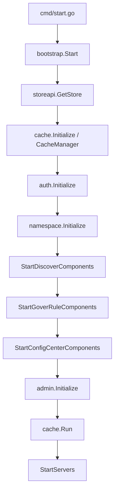
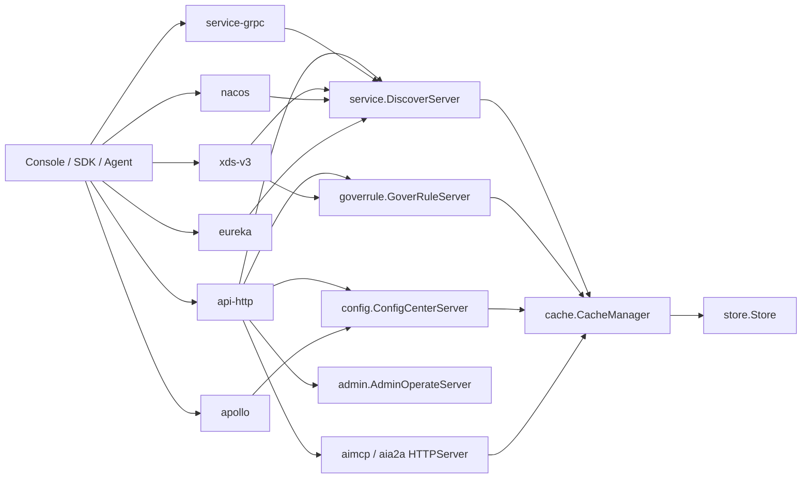
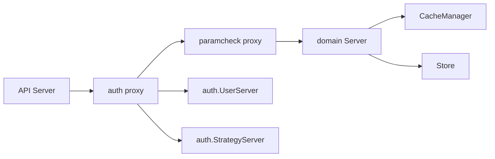

`pole-control-plane` 的控制面不是单个 HTTP 服务包一层 CRUD。真实启动链路从 `cmd/start.go` 进入 `bootstrap.Start`，再由 `bootstrap/server.go` 按顺序装配存储、缓存、鉴权、命名空间、注册发现、治理规则、配置中心、运维模块和 API Server。

核心结论是：API 协议层可以横向扩展，但业务能力通过共享的 `service.DiscoverServer`、`goverrule.GoverRuleServer`、`config.ConfigCenterServer`、`admin.AdminOperateServer` 与 `cache.CacheManager` 复用同一套资源视图。

## 启动顺序

`bootstrap.StartComponents` 的顺序很关键：

1. 从 `storeapi.GetStore()` 取得存储实现。
2. `cache.Initialize` 创建 `CacheManager`，并注册服务、实例、治理规则、配置、用户、策略、MCP Server、A2A Agent 等缓存。
3. `auth.Initialize` 初始化用户与策略服务，后续业务 Server 的 auth interceptor 依赖它。
4. `namespace.Initialize` 建立命名空间服务。
5. `StartDiscoverComponents` 初始化注册发现，包括批处理控制器、健康检查和 `service.Initialize`。
6. `StartGoverRuleComponents` 初始化治理规则 Server。
7. `StartConfigCenterComponents` 初始化配置中心。
8. `admin.Initialize` 装配运维操作模块。
9. 最后 `cache.Run` 启动缓存 warm-up 与周期刷新。

这意味着控制面先完成所有业务 Server 和缓存对象的装配，再启动缓存刷新协程；API Server 对外服务时拿到的已经是完成初始化的共享对象。

## API Server 是插件槽位

API 层由 `apis/apiserver` 的 slot 注册机制驱动。`plugin/apiserver/httpserver/default.go`、`grpcserver/discover/default.go`、`xdsserverv3/default.go`、`nacosserver/default.go`、`apolloserver/default.go`、`eurekaserver/default.go` 分别注册不同协议入口。

`bootstrap.StartServers` 遍历配置中的 `apiserver.Config`：

- 按 `protocol.Name` 从 `apiserver.Slots` 取出具体实现。
- 调用 `slot.Initialize(ctx, option, apiConf)` 注入配置。
- 对 `api-http` 额外把所有 slot 放进 context，便于 HTTP 层暴露或控制其他入口。
- 以 goroutine 调用 `slot.Run(errCh)` 对外监听。

HTTP Server 的 `Run` 方法会从各领域包获取已初始化的 Server：`admin.GetServer()`、`namespace.GetServer()`、`service.GetServer()`、`goverrule.GetServer()`、`authapi.GetUserServer()`、`authapi.GetStrategyServer()`、`healthcheck.GetServer()`。这说明 HTTP 只是协议适配和路由分发层，不持有独立业务状态。

## 业务 Server 通过 interceptor 链扩展

注册发现和治理规则都使用同一个模式：

- `service.RegisterServerProxy` / `goverrule.RegisterServerProxy` 注册代理工厂。
- `GetChainOrder()` 返回 `["auth", "paramcheck"]`。
- `InitServer` 先创建真实 `Server`，再按顺序把它包成 proxy server。

这带来两个效果：

- 鉴权、参数校验不散落在每个协议入口里，而是包在领域 Server 前面。
- HTTP、gRPC、xDS 等入口调用同一业务 Server 时，会自然复用同一套鉴权和校验规则。

## 真实模块边界

| 层次 | 真实入口 | 职责 |
| --- | --- | --- |
| 启动编排 | `bootstrap/server.go` | 按依赖顺序初始化存储、缓存、领域服务、API Server。 |
| 协议入口 | `plugin/apiserver/*` | HTTP、gRPC、xDS、Nacos、Apollo、Eureka、AI MCP/A2A 的协议适配。 |
| 注册发现 | `pkg/service` | 服务、实例、服务契约、客户端上报、发现缓存响应。 |
| 治理规则 | `pkg/goverrule` | 路由、限流、熔断、主动探测、泳道、无损、traffic security/mirror/mock。 |
| 配置中心 | `pkg/config` | 配置组、配置文件、发布与协议适配。 |
| 鉴权 | `apis/access_control/auth` 与 `plugin/access_control/auth` | 用户、策略、资源权限、资源存在性校验。 |
| 缓存 | `pkg/cache` | 增量缓存、强制查询刷新、治理 release active 视图、AI Registry 视图。 |
| 存储 | `plugin/store/mysql` | 资源 CRUD、release 版本、增量查询、事务和统一治理规则表。 |

## 设计含义

文档和官网描述控制面时，应避免把它画成“一个 HTTP API 后接数据库”。更准确的表达是：

- API Server 是多协议适配层。
- 领域 Server 是共享业务语义层。
- interceptor 是横切控制层。
- CacheManager 是读路径和订阅路径的低延迟视图。
- Store 是事实来源，缓存靠增量时间窗口追平。
- AI Native Registry 不是外挂页面能力，而是接入同一缓存和 HTTP API 装配体系的资源类型。
