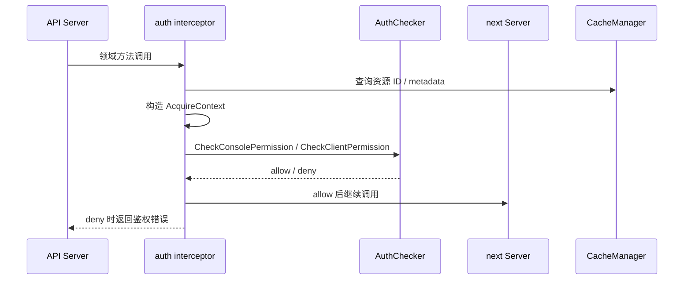
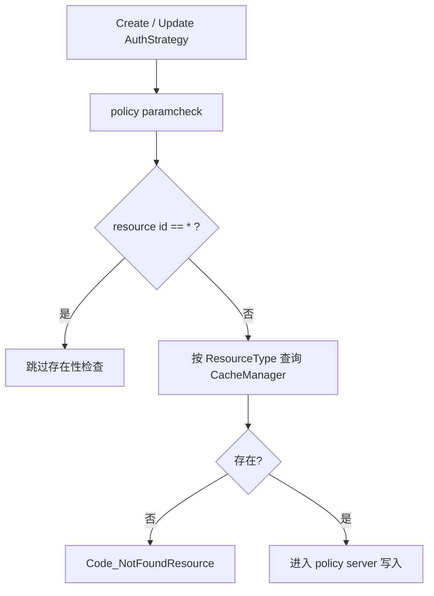
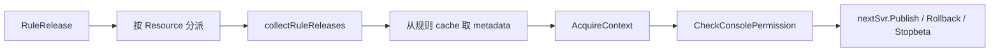

`pole-control-plane` 的鉴权不是 HTTP middleware 层的一段 token 校验。真实实现把鉴权放在领域 Server 的 interceptor 链里，协议入口只负责提取请求和上下文，是否允许操作由 `auth.StrategyServer` 提供的 `AuthChecker` 决定。

核心实现入口：

- `apis/access_control/auth/api.go`：定义 `AuthChecker`、`StrategyServer`、`UserServer`。
- `pkg/service/interceptor/auth`：服务、实例、服务契约等注册发现资源的鉴权代理。
- `pkg/goverrule/interceptor/auth`：治理规则与 release 操作的鉴权代理。
- `apis/pkg/types/auth/funcs.go`：策略资源字段名到 `ResourceType` 的映射。
- `plugin/access_control/auth/policy/interceptor/paramcheck/server.go`：创建和更新策略时检查资源是否存在。
- `plugin/access_control/auth/policy/policy.go`：授权接口、资源详情回填和策略资源规范化。

## 统一上下文：AcquireContext

各业务 interceptor 会构造 `authtypes.AcquireContext`，核心字段包括：

- 请求上下文。
- 操作类型：Create、Read、Modify、Delete 等。
- 模块：例如 `DiscoverModule`。
- 方法名：例如 `PublishRouteRules`、`DescribeTrafficMockRules`。
- 访问资源：按 `apisecurity.ResourceType` 聚合的 `ResourceEntry`。
- 调用来源：Console 或 Client。

然后调用：

- `CheckConsolePermission`
- `CheckClientPermission`

权限失败会被转换成 API code，权限成功后会把更新后的 request context 继续传给下一层 Server。

## 资源类型映射

策略里的资源字段和协议层的 `ResourceType` 不是靠字符串随意拼接。`apis/pkg/types/auth/funcs.go` 维护了明确映射：

| 策略字段 | ResourceType |
| --- | --- |
| `namespaces` | `Namespaces` |
| `service` | `Services` |
| `config_groups` | `ConfigGroups` |
| `route_rules` | `RouteRules` |
| `ratelimit_rules` | `RateLimitRules` |
| `circuitbreaker_rules` | `CircuitBreakerRules` |
| `faultdetect_rules` | `FaultDetectRules` |
| `lane_rules` | `LaneRules` |
| `lossless_rules` | `LosslessRules` |
| `mirror_rules` | `MirrorRules` |
| `security_rules` | `SecurityRules` |
| `mock_rules` | `MockRules` |
| `users` | `Users` |
| `user_groups` | `UserGroups` |
| `roles` | `Roles` |
| `auth_policies` | `PolicyRules` |

同一个文件里的 `ResourceFieldPointerGetters` 负责从 `StrategyResources` 中取出对应 slice 指针。策略创建、授权和详情回填都依赖这套映射。

## 创建策略时先校验资源存在

策略写入前，`policy/interceptor/paramcheck/server.go` 的 `checkResourceExist` 会逐类检查资源是否存在。它不是只检查 namespace/service/config group，也包括治理资源：

- route rules
- rate limit rules
- circuit breaker rules
- fault detect rules
- lane rules
- lossless rules
- traffic security rules
- traffic mirror rules
- traffic mock rules

特殊规则是：资源 ID 为 `*` 时跳过存在性检查，表示全量授权。

这条链路保证策略不会引用一个已经不存在的治理资源。后续如果新增资源类型，必须同时更新：

- 字段名映射。
- 指针 getter。
- policy paramcheck 的存在性检查。
- policy detail 的资源信息回填。
- 业务 interceptor 的资源收集。

## 治理 release 的鉴权

治理规则发布、查询版本、删除版本、回滚、停止灰度都经过 `pkg/goverrule/interceptor/auth/release.go`。

`PublishGovernanceRules` 会根据 `RuleRelease.Resource` 分派到不同方法名，例如：

- `PublishRouteRules`
- `PublishRateLimitRules`
- `PublishCircuitBreakerRules`
- `PublishFaultDetectRules`
- `PublishLaneGroups`
- `PublishLosslessRules`
- `PublishTrafficSecurityRules`
- `PublishTrafficMirrorRules`
- `PublishTrafficMockRules`

`collectRuleReleases` 再到对应 cache 找规则，把资源 ID、资源类型和 metadata 写进 `AcquireContext`。这让“发布某条规则”不是普通写权限，而是针对具体规则资源的修改权限。

## 列表和详情会标记操作权限

Traffic Security、Mirror、Mock 的列表和详情读取有一个额外行为：读取通过后，auth interceptor 会把每条返回数据反序列化出来，再分别检查 update/delete 权限，并把结果写回响应中的可编辑或可删除标记。

这意味着 Console 不需要自己猜测按钮是否可用，而是可以使用服务端按资源级权限计算出的状态。

## 多协议入口为什么能共享鉴权

HTTP、gRPC、xDS、Nacos、Apollo、Eureka 的身份载体不同，但它们最终会进入 `service.DiscoverServer`、`goverrule.GoverRuleServer` 或 `config.ConfigCenterServer`。鉴权代理包在领域 Server 前面，所以协议层不需要复制权限逻辑。

实际边界是：

- 协议层：解析 token/header/request，进入对应业务 Server。
- auth interceptor：构造 `AcquireContext`，调用 `AuthChecker`。
- policy/user server：校验凭证、策略、角色、资源。
- 业务 Server：只处理已经通过鉴权的领域操作。

## 设计边界

- 鉴权链依赖缓存里的资源视图；缓存未打开或未更新时会影响资源存在性和 metadata 回填。
- `*` 是全量资源授权，不能被当成真实资源 ID 查询。
- 创建策略、授权资源、治理 release 操作是三条不同链路，不能只补其中一条。
- 第三方身份接入应优先适配 Console 用户来源，不应绕过控制面现有 token、policy 和 AuthChecker 链。
