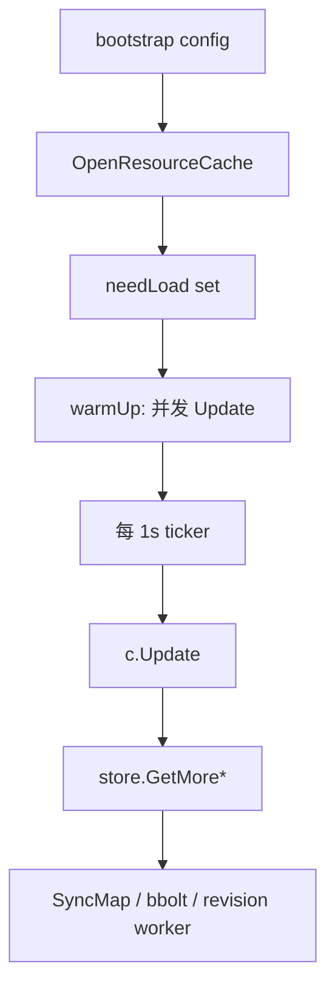
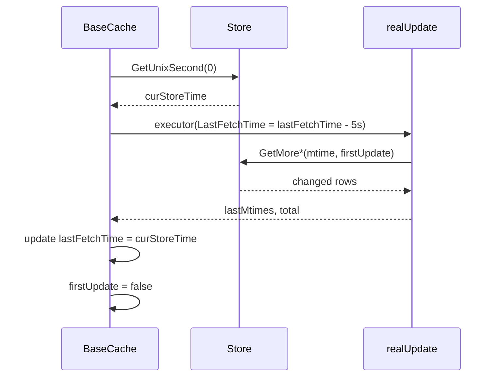
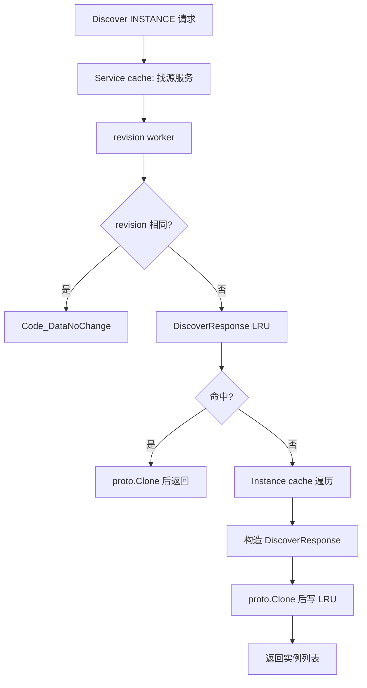
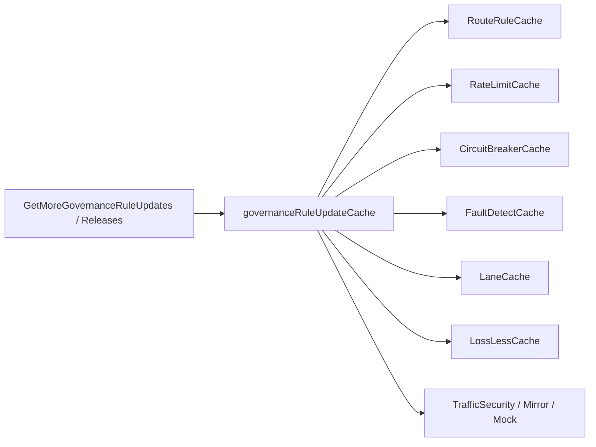
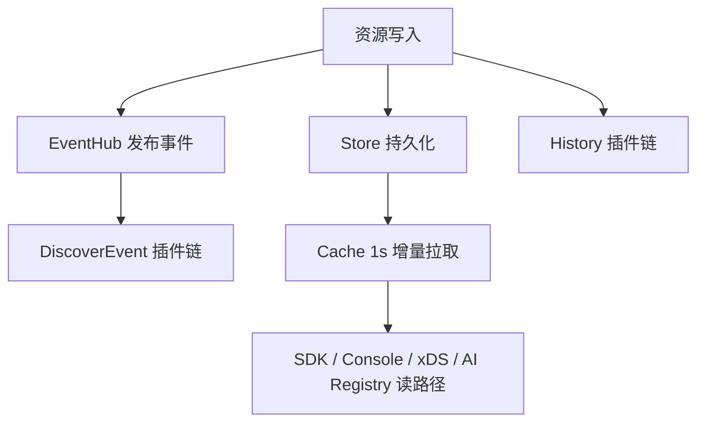

`pole-control-plane` 的缓存层承担两类职责：一是把控制台、SDK、xDS、AI Registry 等读路径从数据库查询中解耦出来；二是把资源变更转换成可订阅、可观测、可快速比较 revision 的内存视图。

核心实现分布在 `pkg/cache/default.go`、`pkg/cache/cache.go`、`pkg/cache/base/types.go`、`pkg/service/client_v1.go` 和 `pkg/cache/rules/governance_rule_update.go`。

## CacheManager 注册的资源视图

`pkg/cache/default.go` 在 init 阶段注册 cache name 与 index，`newCacheManager` 再创建具体缓存实例。当前真实代码包含这些类别：

- 命名空间、服务、实例。
- 服务契约。
- 路由、限流、熔断、主动探测、泳道、无损。
- traffic security、traffic mirror、traffic mock。
- 配置文件、配置组。
- 用户、角色、鉴权策略。
- SDK Client。
- 灰度资源。
- MCP Server、A2A Agent。

`CacheManager.OpenResourceCache` 只打开配置中要求加载的资源。被打开的 cache name 会进入 `needLoad`，`CacheManager.Start` 先 warm-up 一次，再按固定间隔刷新。

## BaseCache 的时间窗口

所有主缓存都复用 `pkg/cache/base/types.go` 的 `BaseCache`。它维护：

- `lastFetchTime`：上次成功刷新时读取到的数据库时间。
- `firstUpdate`：首次加载时通常要加载全量有效数据。
- `lastMtimes`：不同标签对应的最大 mtime，用于日志和增量判断。
- `singleflight.Group`：避免同一 cache 被并发强制刷新时重复击穿存储。

`BaseCache.LastFetchTime()` 会把 `lastFetchTime` 加上 `CacheManager.GetTimeDiff()`。默认 `DefaultTimeDiff = -5s`，也可以通过 `cache.diffTime` 配置覆盖。这个负偏移是为了容忍数据库时间、控制面节点和事务提交之间的边界偏差：下一次增量查询会回看一个小窗口，而不是刚好从上次秒级时间戳之后开始。

`DoCacheUpdate` 只有在 executor 没有 panic 且返回成功时才更新 `lastFetchTime`。如果首次拉取失败，它不会把时间推进到当前值，从而避免后续增量永远为空。

## 发现热路径：revision 与完整响应缓存

`pkg/service/client_v1.go` 的 `ServiceInstancesCache` 是 SDK 发现实例的关键读路径。

处理流程如下：

1. 从服务缓存取源服务，别名会落到真实服务。
2. 记录调用拓扑。
3. 通过 `Service().GetRevisionWorker().GetServiceInstanceRevision(serviceID)` 取实例 revision。
4. 如果客户端传入 revision 与当前 revision 相同，直接返回 `DataNoChange`。
5. 如果 revision 不同，按 `namespace + service + revision + onlyHealthy` 查 `discoverResponseCache`。
6. 命中完整响应缓存时直接返回 clone 后的 `DiscoverResponse`。
7. 未命中时遍历实例缓存构造响应，并写回 LRU。

完整响应缓存的实现位于 `pkg/service/discover_response_cache.go`：

- 默认 LRU 大小为 1024。
- key 格式为 `INSTANCE:namespace:service:revision:onlyHealthy`。
- `Get` 和 `Put` 都使用 `proto.Clone`，避免共享 protobuf 指针被调用方或发送链路修改。
- `reportDiscoverCacheCall` 把 revision 命中和 response 命中上报到 `statis`，类型为 `DiscoverCacheCallMetric`。

## 治理规则的共享更新器

治理规则缓存除了常规 `realUpdate`，还有一个更特殊的更新路径：`pkg/cache/rules/governance_rule_update.go`。

各类治理缓存初始化时会调用 `registerGovernanceRuleWatcher`。如果底层 store 实现了 `GetMoreGovernanceRuleUpdates` 和 `GetMoreGovernanceRuleReleaseUpdates`，多个治理 cache 会共享一个 `governanceRuleUpdateCache`。

刷新时它会一次性拉取全部治理规则 update 和 release update，再分发给 watcher：

- `RouteRuleCache.applyGovernanceRuleUpdate`
- `rateLimitCache.applyGovernanceRuleUpdate`
- `circuitBreakerCache.applyGovernanceRuleUpdate`
- `faultDetectCache.applyGovernanceRuleUpdate`
- `LaneCache.applyGovernanceRuleUpdate`
- `LossLessCache.applyGovernanceRuleUpdate`
- `TrafficGovernanceCache.applyGovernanceRuleUpdate`

这个设计避免每一种治理规则都单独查询一次统一规则更新表，也让 release active 视图在同一轮更新里被推进。

## EventHub 的位置

EventHub 不替代缓存轮询，它承担资源事件广播。

注册发现 Server 在 `pluginInitialize` 中订阅 `eventhub.InstanceEventTopic`，把实例事件交给 `DiscoverEvent` 插件链。服务实例创建、更新、删除、推空保护开关等操作会在 `pkg/service/instance.go` 发布事件。历史记录则由治理规则 Server 的 `RecordHistory` 调用 `history.GetHistory().Record` 写入 composite history 插件链。

因此真实数据流是：

## 设计边界

- 缓存是读模型，不是事实来源；事实来源仍是 store。
- `lastFetchTime - 5s` 解决的是增量窗口丢变更风险，不解决业务冲突。
- 发现热路径靠 revision 与响应缓存减少实例遍历，不改变实例本身的缓存一致性模型。
- EventHub 更适合做事件通知和观测，不应把它理解成所有缓存更新的唯一来源。
